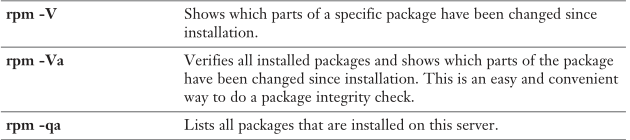

**Man commands**:

**#man hier** : displays Linux hierarchy with explanation of each directory

#**mandb**: build the man pages

#**man -k <cmd> or apropos <cmd>:** search in mandb for a particular command using a keyword

**#man 1 command**: displays section 1 (user commands), you can also use 8 for admin commands

**IMPORTANT** : **#man --regex -wK 'RestartSec' :** search for keyword ‘RestartSec’ in all man pages and print them

\
\
\

**Vi stuff**:

**/keyword**: forward search

**?keyword**: backward search

**dd**: delete current line

**d + [end, ->, <-..]:** delete in direction

**yy**: copy current line

**y**: copy selection

**p**: paste

**v**: visual mode, used to select text

**u**: undo

**Ctrl+r**: redo

**o**: insert in new line		

**:%s/old\_word/new\_word/g**: substitute/replace globally

\
\
\

**Globbing**:

**#touch script{0..100}:** create 100 files: script0, script01…script100

**#ls ?cript:** search for any character followed by “cript”

**#ls ?cript[0-9][0-9]:** e.g script01

**#ls [hm]ost**: e.g most, host

**#ls [!hm]ost:** doesn’t start with h/m

#**ls -d**: do not display directories content, only names

**File Management**:

**#rmdir:** only removes empty directories

**#rm -rf scripts/:** delete all files within scripts/ recursively and do not ask for confirmation

**#which useradd:** it will display the path to useradd command (e.g /usr/sbin/useradd), only works when the command is in $PATH

**#locate myFile:** search for myFile, it searches within a DB, the db needs to be updated frequently, otherwise newer files won’t be located, use **updatedb** command to synch DB. 

**#find / -name myFile -type f -size +100M**: self-explanatory

**#find / -user student:** find all files owned by user “student”

**#find /etc -exec grep -l student {} \;** : execute grep -l on output of find, the “{}” is replaced by the file found by “find” command

**#find /etc -size +100c -exec grep -l student {} \; -exec cp {} /tmp \;** : same as above, but copy the files to /tmp

**#ln /etc/hosts /root/hardhosts**: create a hardlink, **ln -s** would create a soft link.

Hardlinks has the same inode (a unique number given to every linux file) as they point to the same file, you can use **ls -i** to display inode number, hardlink points to the inode which points to the disk block.

Synbolic links are like shortcuts, they only point to the original file and has unique inode number, deleting the original file would make the symb link invalid.

**#tar -cvf myfile.tar /etc /home** : add /etc and /home to myfile.tar (no compression)

**#tar -tvf myfile.tar** : explore myfile.tar

**#tar -xvf myfile.tar -C /tmp** : extract to /tmp

**#gzip myFile** : Compress myFile, use **-k** to not delete original file

**#gzip -c myFile > /tmp/mygzipFile** : gzip to a location by forwarding stdout (-c) to a file

**#gunzip myFile.gz** : extract a gzip file, use **-k** to keep and **-c** to extract to location

**NOTE**: bzip2 and xz both have same syntax as gzip, xz has a better compression overall.

**Working with text files**:

**#tail / head**: self-explanatory, use -n NN to specify number of lines to display

**#cat**: obvious, **-A** displays EOL, tabs.., **-s** removes empty lines and **-b** display line numbers, **tac** displays text file in opposite order.

**#cut -f 3 -d “:” /etc/passwd**: display field 3 in a column-separated text file.

**#cut -f 3 -d “:” /etc/passwd | sort** : sort result, **-n** option to specify that result is numeric

**#cut -f 1 -d “:” /etc/passwd | sort | tr [:lower:] [:upper:]** : tr transforms lower cases to uppers

**#grep ayoub /etc/password** : search for keyword “ayoub”

`	`**-i** : key insensitive

`	`**-l** : list only file name without the content

`	`**-R**: recursive search

`	`**-A5** / **-B5**: list 5 lines after / before the keyword

**#ps -ef | grep ‘\<dd’** : search for word starting with ‘dd’

**NOTE:** grep uses regex as search pattern, extended regex (such as .?) can also be used using egrep, e.g: **#egrep ‘a.?b’ /etc/passwd**

**#pgrep ‘\<dd’ :** grep processes that has word ‘dd’

**#sed -i s/oldword/newword/g /home/myfile** : replace oldword with newword, -i (in-place editing) will modify the file, if not specified, result will be printed out, you can use **/gi** instead of **/g** to ignore case. 

**#sed 's/[hH]ello/BONJOUR/g' sedfile** : regex, replace hello or Hello with BONJOUR

**#sed -n ‘5,10p’ myfile** : prints (**p**) lines 5 to 10.

**#sed ‘5,10d’ myfile** : delete (**d**) lines 5 to 10 and print the rest.

#**sed -n -e '5,7p' -e '10,13p' myfile.txt** : execute multiple sed commands

`	`**-n** : only print what explicitly asked to be printed, e.g ‘4,10**p**’. 

`	`**-e** : editor-command pass a command to the editor.

**Connecting to RHEL server**:

**#chvt 4** : change to virtual terminal (vt) 4, by default there are 6 VTs, this command cannot be executed on SSH session, only on locally, you can also use **ctrl+alt+[F1, F2, …, F6]** to switch.

**#w** : check who is connected on which terminal

**#visudo** : special vi editor for sudoers file, **visudo -c** checks the validity of sudoers.

\- To add user to sudoers file, add him to the group ‘**wheel’**,** for example **#usermod -G wheel myuser**, changes will only take effects after the user logs out (#exit)

\- You can also only grant users execution of some specific commands, to do so, visudo then add something like:

**linda   ALL=/usr/sbin/useradd, /sbin/passwd, /usr/sbin/usermod**

explanation : linda (user)	ALL (all machines, or ‘localhost’ for local machine)=\*commands separated by ‘,’\*

**Users & Groups management:**

**#useradd -c “this is bill” bill**: create user bill with comment “this is bill”

**#useradd -D**: list default settings, these settings are stored in /etc/default/useradd

**#usermod -aG wheel bill**: (-a) append (-G) group wheel, without -a, existing groups will be removed from account.

**#userdel -rf bill**: force (-f) delete user bill along with home directory and mail spool (-r)

**#passwd bill**: change password for bill

`	`-l : lock

`	`-u: unlock

**#echo password | passwd --stdin bill**: change password without prompts.

\- The **/etc/login.defs** file provides default configuration information for several user account parameters. The useradd, usermod, userdel, and groupadd commands, and other user and group utilities take default values from this file. Each line consists of a directive name and associated value.

\- Files in **/etc/skel** are copied automatically to home directories when users are created.

\- Understanding **/etc/passwd**

\- Passwords are stored in **/etc/shadow**

\- **/etc/group** is used for group definition and properties, for example

**wheel:x:10:student,bill** : groupName:groupPassword(no longer used):GID:members

\- primary groups are stored in **/etc/passwd**, secondary groups stored in **/etc/group**

**#groupadd sales** : create group sales

**#groupmod -n salesteam sales**: change the group name sales to salesteam

**#groupdel salesteam**: delete salesteam group

**#lid -g wheel**: list all users members of group “wheel”

\- for password management, use **#chage** to control password age settings (stored in /etc/shadow), **#chage linda** is an interactive command to change password settings for linda, **#passwd** also offers the same options + possibility to lock/unlock account passwords.

**Permissions:**

**#chown anna /tmp/file**: change user ownership to anna

**#chown anna:students /tmp/file**: change user & group ownership

**#chgrp students /tmp/file**: change group membership to students (=**chown :students /tmp/file**)

**#chmod 755 /tmp/file**: change permission to rwxr-xr-x

**#chmod +x**: same as chmod a+x (add execution permissions to all users/groups/others)

**#chmod -x,o+rw**: all -x and rw for others

\- umask is a command that subtracts permissions during files/directories creations.

**#umask 022** would subtracts write permission from groups and others

\- default umask value can be changed on **/etc/profile** (not recommended) or per user profile in **/home/myuser/.bash\_profile** (recommended)

\- if umask is 022, and you create a file, without umask, it will get 666 since in Linux, you’ll never get execute (x) right by default, applying umask will give you a file with permissions 644.

\- **setuid** allows you to execute a file in user owner context, for example if myprogram has owner **root** and setuid is set, then any user can execute myprogram with root privileges, **passwd** command for example has setuid enabled which allows it to write on **/etc/shadow**

**#chmod u+s /data/myprogram**: setuid on myprogram, chmod **4**XXX to use numeric mode.

Result is an ‘s’: -rw**s**r-xr—(capital S means x isn’t set)

NOTE: setuid only works on complied binaries and NOT shell scripts (#!/bin/bash)

\- setgid on files allows you to execute files as group owner

\- setgid on directory means that all files under this directory will inherit the group owner  

**#chmod g+s /data/myfile**: adds setgid to myfile

**#chmod g+s /data/**: adds setgid to /data/, all files created under /data/ will have the same group ownership as /data/ (very useful for shared directories).

Result is an ‘s’ in group section: drwxrw**s**--- (capital S means x isn’t set)

\- The **sticky** **bit** is a permission bit that protects the files within a directory. If the directory has the sticky bit set, a file can be deleted only by the owner of the file, the owner of the directory, or by root. This special permission prevents a user from deleting other users' files from public directories such as /tmp :

`	`drwxrwxrw**t** 7  root  sys   400 Sep  3 13:37 tmp (capital T means x isn’t set)

#**chmod +t /data/** : set sticky bit on /data/

\- Since ownership is only for one user and one group, ACLs can be used to extend permissions on a file/folder, setfacl and getfacl are used, when ACL is applied a ‘+’ is shown beside item perm, e.g : drwxrwxr-x**+**

**#getfacl /data/sales** : shows current ACLs applied to sales folder

**#setfacl -m d:u:lisa:rwx profs/** : default ACL, grant user lisa rwx on profs folder, you can use -d instead of d:

**#setfacl -m d:g:profs:rwx students/** : default ACL, grant group profs rwx on students folder

**#setfacl -m o:rx students/** : access ACL, grant others access to students folder

NOTE: the default ACL (-d or d:) doesn’t apply on existing files, only new files/directories inherit the ACL, default ACL doesn’t apply on the parent folder directly, so make sure an access ACL is specified so users can access parent directories and subdirectories.

\- You can use **u::**rwx to target the owner or **g::**r—to target current group

**Networking:**

**#ip link show**: shows current NICs

**#ip -s link show**: shows NICs statistics such as packets transferred (TX) and received (RX)

**#ip addr show** : shows ip address of all devices

**#ip addr add dev ens33 10.0.0.7/24**: add a secondary ip address to device ens33, only available at runtime

**#ip route show**: show default route used to reach the internet

default via 192.168.192.2 dev ens160 proto dhcp metric 100

default via 172.20.10.1 dev ens224 proto dhcp metric 101

**#ip route del default via 192.168.192.2** : delete the default route

**#ip route add default via 192.168.192.2** : add a new default route

**NOTE**: ip command only changes runtime config, use nmcli for persistence.

\- **nmcli** is a powerful command-line utility to perform network-related activities, **nmtui** is a text-based utility less complex than nmcli.

\- nmcli uses ‘connections’, a connection is basically the link between the network interface and the configuration file containing addresses...

**#nmcli connection show**

**#nmcli connection add con-name myTestConnection ifname ens33 ipv4.method manual ipv4.addresses 192.168.192.20 ipv4.dns 8.8.8.8 ipv4.gateway 192.168.192.2 type ethernet**  : add a new connection to ens33

**NOTE**: if ipv4.manual isn't set, interface will rely on DHCP and NOT the manual configuration provided

**#nmcli conection mod myTestConnection +ipv4.addresses 10.0.0.10** : modify current connection and add a secondary ip address

**#nmcli connection up MyTestConnection** : will load the newly created connection

**#nmcli general hostname server.example.local** : change persistent hostname

**#man nmcli-examples** : check load of useful examples

**NOTE**: nmcli & nmtui + other tools write network parameters in the following config file **/etc/sysconfig/network-scripts/ifcfg-myTestConnection**, you can make changes directly within the file, after that, restart NetworkManager service, or use **#nmcli connection up myConnectionName**.

**#systemctl status NetworkManager**  : Check NetworkManager status

**#ping** -c 1 google.com : 1 ping

**#ping** -f google.com : send packets to google and display % of packet loss

**#dig myserver**.com : get DNS information about server

**Managing processes:**

\- process is a program under execution

\- job is a concept used by shell – commands started by shell and can be managed by “jobs” command

**#command &** : run in background, this will display job number and process ID, eg: [1] 133468

**#fg 1** : bring job with jobID=1 to the foreground

\- If job is running in foreground, pause it using ctl+Z and then use bg to make it in background, ctl+C to kill.

**#ps aux or ps -ef**: print all processes along with the command used to start them

**#ps -fax** : print a hierarchical view of all processes

**#ps -fU student** : prints processes owned by student

**#ps -f --forest -C sshd** : shows hierarchical view of process sshd

**#ps L** : show format specifier (such as ppid, pid, cmd, user …)

**#ps -eo pid,ppid,user,cmd,%cpu,%mem** : shows more details using specifiers

**#pgrep sshd**: displays all PIDs having a name containing ‘sshd’

**#free -h** : displays memory usage in human-readable format (-m for Mo, -g for Go …)

**#uptime** : displays information about load average in the last 5, 10 and 15 minues

\- As a rule of thumb, the load average should not be higher than the number of CPU cores in your system. You can find out the number of CPU cores in your system by using the #**lscpu** command. If the load average over a longer period is higher than the number of CPUs in your system, you may have a performance problem.

**#top**: show a real time overview on processes

`	`**f** : to add/remove columns

`	`**W** : to write current settings to file

`	`**k** : to kill a process by PID | **r** : renice a task by PID

`	`**M** : sort by memory usage | **P** : sort by CPU usage

**#kill -15 12345 :** nicely (**SIGTERM**) kill process ID 12345 (recommended), you can use **-9 (SIGKILL)** to brutally kill (not recommended).

**#pkill myprogram** : kill process myprogram

**#killall dd :** kill all dd processes (useful, it uses name instead of PID)

**NOTE:** by default, all processes start with same priority value (20), When using nice or renice to adjust process priority, you can select from values ranging from –20 to 19. The default niceness of a process is set to 0 (which results in the priority value of 20). By applying a negative niceness, you increase the priority. Use a positive niceness to decrease the priority. It is a good idea not to use the ultimate values immediately. Instead, use increments of 5 and see how it affects the application.

**NOTE:** Some processes has ‘rt’ (real-time) tag as propriety, these are kernel processes, there is no way to change that or set priority to ‘rt’.

**#nice -n -10 /opt/myprogram** : start myprogram with nice value=-10

**#renice -n  0 12345** : set nice value of process 12345 to 0

\- To offer the best possible performance right from the start, RHEL 8 comes with **tuned**. It offers a daemon that monitors system activity and provides some profiles. In the profiles, an administrator can automatically tune a system for best possible latency, throughput, or power consumption.

**#systemctl status tuned**

**#tuned-adm list** : list available profiles + active profile (also, **tuned-adm active** to only show active profile)

**#tuned-adm profile desktop** : switch to desktop profile, use **tuned-adm recommend** for best suggestion

**Managing Software:**

\- RHEL8 comes with 2 repos, **appStream** repo for apps and **BaseOS** for kernel packages.

\- In order to create a local repository based on RH ISO image, you need to:

`	`- Mount the iso image locally, eg. **dd if=/dev/sr0 of=/rh.iso** and then mount iso

`	`- create 2 files in /etc/yum.repos.d

`	`- File1 for appStream apps, e.g appstream.repo and file2 for baseOS packages

`	`[appstream]					[baseOS]

`	`name=appstream				name=baseOS

`	`baseurl=file:///repo/AppStream			baseurl=file:///repo/BaseOS

`	`gpgcheck=0					gpgcheck=0

`	`- run **#yum repolist** to verify the availability of the newly created repository

**#yum search nmap**: search for nmap in all repos

**#yum install nmap :** install nmap

**#yum remove nmap :** remove nmap

**#yum update nmap :** install latest version if any

**#yum provides \*/nmap** : deep search, search for nmap in packages

**#yum info nmap** : gives more info about nmap package

**#yum list all :** lists all packages in all repos

**#yum list installed**: lists all installed packages

**#yum clean all** : clean all repos metadata and cache entries, yum will download and cache everything next time

\- yum also provides group management, for ex. If you want to download all packages suitable for end-user laptops and PCs, there is a ‘**Workstation’** group containing all packages, similarly, ‘**Virtualization Host**’ group contains all packages if you want to deal with virtualization

#**yum group list [hidden]:** list available groups / ‘hidden’ list also groups that are rarely used

**#yum group info “Workstation”** : shows packages + optional packages

**#yum group install Workstation [--with-optional]**: install Workstation group / Also install optional packages

**#yum group list ‘Virtualization Host’** : list groups within this group

**#yum history** : show all yum actions history (install, remove …)

**#yum history undo 4 :** will undo action 4, in this example, it will install nmap

\- Yum also supports ‘**modules’**, A delivery mechanism to install RPM packages. In a module different versions (streams) and profiles can be provided.

`	`- **Stream** : specific version of module

`	`- **Profile** : A collection of packages that are installed together for a particular use case

`	`- **Package** : RPM packages

**#yum module list** : List all available modules from all repos

**#yum module list postgresql** : list postgresql modules

**#yum module list postgresql:10 --profile** : show profiles of postresql:10 stream

**#yum module info postgresql** : displays more info (more than ‘list’), including packages names.

**#yum module enable postgresql:9.6** : enable stream 9.6 of postgresql, any installation/update will go through this stream (optional, see next). If error saying you can’t switch when enabled => **#yum module reset postgresql**

**#yum module install postgresql:9.6/client** : will install postgres version 9.6, ‘client’ profile. It will also enable stream postgresql:9.6

**#yum module install postgresql:10/client :** switch to the newer version of postgresql 10

\- rpm command shouldn’t be used anymore to install packages, it doesn’t resolve dependencies, even if you have a package file, use **#yum install mypackage.rpm** as it will resolve all dependencies, it is useful however to query packages.

\- if you need to execute rpm command on \*.rpm file, use **yumdownloader** to download package from repo.

**#yum install dnf-utils** : will install useful utilities including yumdownloader

**#yumdownloader nmap** : download nmap package locally for further analysis

\- **repoquery** command can be used to query packages (like -qp) directory in their repos, see repoquery –help

**#subscription-manager register** : to register server on RH (will ask for username + password)

**#subscription-manager attach --auto** : to attach server to subscription and start using RH repos

**Working with systemd:**

\- the Systemd System and Service Manager is used to start stuff. The stuff is referred to as units. Units can be many things. One of the most important unit types is the service.

**#systemctl -t help** : displays various units types (-t) that can be managed using systemd

**#systemctl list-unit-files** : list all unit files + status (enabled, disabled …)

**#systemctl list-units**  : Lists active units in the system** (**--type=[target|service|socket…]**)

**#systemctl status vsftpd** : Check status of vsftpd service

Loaded: loaded (/usr/lib/systemd/system/vsftpd.service; **disabled**; vendor preset: disabled)

\- The above means that the service won’t automatically start after next boot.

**#systemctl enable vsftpd** : enable vsftpd, it will start automatically next bootup, status will be enabled.

**#systemctl start vsftpd** : Start service vsftpd

\- system unit location are :

`	`- **/usr/lib/systemd/system** : Never touch it, it is copied during RPM installation

`	`- **/run/systemd/system** : contains unit files that have automatically been generated, rarely used

`	`- **/etc/systemd/system** : contains custom unit files, use **#systemct edit myservice.service** to auto-create 

`  `the file and its configuration

**#systemctl cat vsftpd.service** : cat the unit file of vsftpd service

**-** Service** unit file example:

**[Unit]**

Description=Vsftpd ftp daemon

After=network.target

**[Service]**

Type=forking

ExecStart=/usr/sbin/vsftpd /etc/vsftpd/vsftpd.conf

**[Install]**

WantedBy=multi-user.target

**#systemctl show vsftpd.service**  : shows all parameters that can be used for vsftpd, use **#man 5 systemd-system.conf** to see explanations of parameters

**IMPORTANT :** When you change a configuration of a service, use **#systemctl daemon-reload** and **#systemctl restart myService.service** for the configuration to take effect

**-** Other types of units also exist, such as sockets (e.g cockpit) and mounts (e.g tmp), each has its own parameters, check man (5) pages of system.mount, system.socket for more info, also check study guide.

**-** Target units are like group of units; they are units logically grouped which makes it easier to manage at once instead of one by one

**Tasks scheduling:**

**#systemctl status crond :** Check the status of crond daemon which takes care of executing cron tasks

**IMPORTANT #man 5 crontab :** Contains all Cron time specifications

**#crontab -e :** edit crontab for current user | **#crontab -l** : list cron jobs for the current user

**#crontab -e -u anna :** edit crontab of user anna (needs to be root)

**#crontab -r -u anna** : remove crontab entries of user anna

\- Check **/etc/crontab** to see the format used by crontab

\- When crontab entries are created, a file with the username (e.g anna) is created under **/var/spool/cron**, DO NOT edit that file directly, it is managed by cron.

\- Alternatively (second way), you can also directly create files (file name doesn’t matter) under **/etc/cron.d** with the following format: 

**\* \* \* \* \* <username> <command>**

**30 0 1 \* \* anna logger hello**

NOTE: when using #crontab -e, you don’t have to specify the username since it will automatically be executed using current user who issued the crontab -e command, if modifying /etc/crontab or creating files under /etc/cron.d, username must be specified.

\- Third way to schedule Cron jobs, is by creating files under **/etc/cron.hourly**, **/etc/cron.daily**,  **/etc/cron.weekly**, **/etc/cron.monthly**. In these directories, you typically find scripts (not files that meet the crontab syntax requirements) that are put in there from RPM package files. When opening these scripts, notice that no information is included about the time when the command should be executed. That is because the exact time of execution does not really matter. The only thing that does matter is that the job is launched once an hour, day, week, or month.

\- crontab is concise, if laptop/server is off when command is scheduled, it won’t be executed after. That’s why **anacrontab** is useful, it is used to schedule jobs hourly, daily, weekly or monthly, the exact time of execution doesn’t matter, even if server/laptop is off, anacrontab will make sure to execute your script/job. Use **/etc/cron.hourly** and the rest** to configure your jobs, anacrontab will make sure to execute them.

\- to deny users from using cron, put their names in **/etc/cron.deny**, users not listed in this file are allowed, it works like blacklists, you can also use **/etc/cron.allow** to allow only specific users to use cron, users not listed are disallowed (whitelisting). Both files cannot exist at the same time, if neither of the 2 exist, then only root is allowed

\- For jobs that only need to be executed once, use **at** or **batch**

**#at 14:00**

**> logger Hello World!**

**> Ctrl-D**

(This will execute the command logger @ 2PM)

**#at [midnight, noon, teatime]** : aliases, check **#man at**

**#at 11:30 102121** : schedule on 11:30 AM on 21 Oct 2021 (MMDDYY)

**#atq (or at -l)**: Shows current schedule at jobs

**#atrm 1** : delete job 1 from queue

\- To manage temporary files, **systemd-tmpfiles-clean.service** is used

\- To create your own custom tmp file config, create a conf file under /etc/tmpfiles.d/mytmp.conf

\- put some configuration such as (check man tmpfiles.d for all possible options):

#Type Path        Mode UID  GID  Age Argument

d /etc/mytmpdirectory/ 0755 root root 30s -

r /etc/mytmpdirectory/myfile

**#systemd-tmpfiles --create /etc/tmpfiles.d/mytmp.conf** : tell tmpfiles daemon about the new entry

\- Then you can either wait for systemd-tmpfiles-cleaner.timer to be triggered or use **#systemd-tmpfiles --clean** to trigger it manually 

**Configuring Logging:**

\- Service can write log message using:

`	`- Direct write | 		-rsyslogd |		-journald

**#journalctl :** check journald log messages (-f for live monitoring, -n 20 for last 20 lines)

**NOTE :** Because the journal that is written by journald is not persistent between reboots, messages are also forwarded to the **rsyslogd** service, which writes the messages to different files in the **/var/log** directory. rsyslogd also offers features that do not exist in journald, such as centralized logging and filtering messages by using modules. Numerous modules are available to enhance rsyslog logging, such as output modules that allow administrators to store messages in a database.

To get more information about what has been happening on the system, administrators have to take three approaches:

\- Monitor the files in **/var/log** that are written by rsyslogd.

\- Use the **journalctl** command to get more detailed information from the journal.

\- Use the **#systemctl status <unit>** command to get a short overview of the last significant events

\- main system logs are:

 

\- rsyslog needs rsyslogd running

\- To configure rsyslog logging, **/etc/rsyslog.conf** is used, it also includes all configurations put in **/etc/rsyslog.d/\*.conf**, so make sure to put configuration in this directory.

\- rsyslog.conf file looks something like this:

The first part defines facilities and priorities, the second one defines destination file.

If a dash ‘-’ is specified before destination (e.g -/var/log/messages), that means the log messages will not be immediately committed to the file but instead will be buffered to make writes more efficient.

Facilities are fixed in Linux and cannot be extended, below is the list of all facilities:

If there are services that do not have their own rsyslogd facility that need to write log messages to a specific log file anyway, these services can be configured to use any of the local0 through local7 facilities.

To determine which types of messages should be logged, different severities can be used in rsyslog.conf lines. These severities are the syslog priorities.

Priorities:

\- When a specific priority is used, all messages with that priority and higher are logged according to the specifications used in that specific rule.

\- If you want to only send a specific priority, use ‘=’ : e.g **cron.=debug 	-/var/log/cron.debug**

**IMPORTANT:** use **#man 5 rsyslog.conf** to get list of facilities & priorities to use.

**- journalctl** is another way to check logs, by default it is not persistent, create a directory **#mkdir /var/log/journal** and set **Storage=auto** in **/etc/systemd/journal.conf** for persistence. **#systemctl status <unit>** also reveals recent logs from journald.

\- journalctl has many filters that can be used such as **#journalctl \_UID=1000** (show all logs created by uid 1000), **#journalctl \_SYSTEMD\_UNIT=sshd.service** shows all sshd related logs

Use man **#man systemd.journal-fields** for all possible fields and filters.

**#journalctl -p [err|notice|warning..]**  : filter using priorities

**#journalctl -o verbose** : This shows different options that are used when writing to the journal.

\- To make journald journal persistent:

1. **#mkdir /var/log/journal**
1. **Set Storage=auto in /etc/systemd/journal.conf** 
1. **#chown root:systemd-d-journal /var/log/journal**
1. **#chmod 2755 /var/log/journal**
1. **Reboot** or use **#killall -USR1 systemd-journald**

\- Log rotation is started every day by cron.daily

\- to change default log rotation policy, use **/etc/logrotate.conf**, snap-in files in **/etc/logrotate.d/**

**#man logrotate** for all options and examples.

**Managing Storage:**

\- Hard disks can be partitioned into multiple partitions, we distinguish 2 types of partition schemes:

- **MBR** (Master Boot Record) : Invented in 1980s, has a limitation of 2To and can only support 4 primary partitions, if more is needed, the 4th partition can be extended to include more logical partitions up to 15, it also uses BIOS partition table.
- **GPT** (GUID Partition Table) : More modern scheme that supports disks with up to 8 Zb in disk space, up to 128 partitions can be created, it uses UEFI (Unified Extensible Firmware Interface) instead of BIOS, it identifies partitions using GUID and has a backup copy of the GUID partition table is created by default at the end of the disk which is not possible with MDR.

To list information about partitions

**#lsblk** or **#ls /dev/nvm\*** or **#cat /proc/partitions**

\- To manage partitions, you can either use **fdisk** for MBR or **gdisk** for GPT, or **parted** for both

\- You can’t create GPT and MBR partitions on the same disk 

\- To create a gpt partition using parted:

**#parted /dev/nvme0n2**

**#print**

Error: /dev/nvme0n2: unrecognized disk label

**#mklabel gpt** to mark this as a gpt partition, use **#mklabel msdos** to mark it as MBR partiton

**#mkpart one 1MiB 1024MiB** create a partition of total 1GiB starting of the first 1MiB

**#quit**

**#udevadm settle** Apply changes

\- To create MBR partition using fdisk

**#fdisk /dev/nvme0n3**

Command (m for help): **n**

Partition type

`   `p   primary (0 primary, 0 extended, 4 free)

`   `e   extended (container for logical partitions)

Select (default **p**):

Using default response p.

Partition number (1-4, default 1):

First sector (2048-41943039, default 2048):

Last sector, +sectors or +size{K,M,G,T,P} (2048-41943039, default 41943039): **+1G**

....

**//After creating 3 primary partitions, default partition to be created is extended (e)**

Command (m for help): **n**

Partition type

`   `p   primary (3 primary, 0 extended, 1 free)

`   `e   extended (container for logical partitions)

Select (default e):

Using default response **e**.

Selected partition 4

First sector (6293504-41943039, default 6293504):

Last sector, +sectors or +size{K,M,G,T,P} (6293504-41943039, default 41943039):

**//Next, default partition to create is logical**

NOTE: If you get an error message indicating that the partition table is in use, type **#partprobe** to update the kernel partition table.

\- List of common FS

\- Once partition is created, you need to make a file system (like formatting), use mkfs.XXX command..

**#mkfs.xfs /dev/nvme0n1p1**: format partition using xfs FS

**#mkfs.ext4 /dev/nvme0n1p2**: format partition using xfs ext4 FS

**#mount /dev/nvme0n1p1 /mnt :** mount the partition on /mnt/, **THIS MOUNT IS NOT PERSISTENT!!**

**#umount /dev/nvme0n1p1 :** unmount the partition, you can also use **#umount /mnt/**

NOTE: if you get “target is busy.” While unmounting, use **lsof** (list open files) to see which files/programs are being used on this directory, e.g **#lsof /mnt/** will list open files on /mnt

\- It is always better to give a label to partitions, Labels are used to set a unique name for a file system, which allows the file system to be mounted in a consistent way, even if the underlying device name changes, this can be done while making fs, e.g **#mkfs.xfs -L blabla**, or after, use **tune2fs -L** for ext4 and **xfs\_admin -L** for xfs

**#tune2fs -L books /dev/nvme0n1p1**: change label for an ext4 partition

**#xfs\_admin -L articles /dev/nvme0n1p2** : change label for an xfs partition

\- To mount partitions in a persistent way, 2 options:

**Option1**: make the changes in **/etc/fstab** file, for example:

LABEL=myXfsPartition       /xfs            	xfs     	defaults        0 0

/dev/nvme0n3p2             /ext4           ext4   	defaults        0 0

UUID=XXXX-XXXX-XXX-XX		/someDir		ext4		defaults		0 0	

\- The “0 0” are legacy options that aren’t used anymore.

**#systemctl daemon-reload:** tell system units files about the partition changes

**#mkdir /xfs /ext4 /someDir:** create the 2 directories where partitions will be mounted

**#mount -a** : This tells the system to mount any unmounted partition

**#lsblk or #mount** : Make sure partitions are properly mounted

**Option2**: create a system mount file

**#cp /usr/lib/systemd/system/tmp.mount /etc/systemd/system/opt-employees.mount:** copy a default mount file template to be used,  in this example, we are mounting a partition in /opt/employees thus the name opt-employees.mount (subdirectories are represented with ‘-’ in the name of the mount file).

**#mkfs.xfs -L employees /dev/nvme0n3p3 :** format partiton with xfs FS

**#vi /etc/systemd/system/opt-employees.mount**

[Unit]

Conflicts=umount.target

Before=local-fs.target umount.target

[Mount]

What=**LABEL=employees**

Where=**/opt/employees**

Type=**xfs**

Options=**defaults**

**#mkdir /opt/employees**

**#systemctl daemon-reload**

**#systemctl enable --now opt-employees.mount**

**#lsblk or #mount** : Make sure partitions are properly mounted

NOTE: when you create an entry on /etc/fstab, a systemd unit file is generated that can be used to control the mount point, when the entry is removed, the unit is also removed.	

**#xfsdump -f /tmp/employees.dump /opt/employees** : backup (dump) the xfs FS mounted in /opt/employees to /tmp/employees.dump, IMPORTANT: no leading ‘/’ should be added in the end, e.g **~~/opt/employees/~~**

`	`**#xfsrestore -f /tmp/employees.dump /opt/employees :** restore from an existing dump

`	`- To create a swap partition

1\. Type #**fdisk /dev/sda** to open your disk in fdisk. (Use gdisk if you are using a disk with a GUID partition table.)

2\. Press **n** to add a new partition. Specify start and stop cylinders and size.

3\. Type **t** to change the partition type. If you are using fdisk, use partition type **82** (**8200** if using gdisk)

4\. Use **mkswap** to format the partition as swap space. Use, for instance, **#mkswap -L myswap /dev/sda6** if the partition you have just created is /dev/sda6.

5\. Add the new partition to /etc/fstab

LABEL=myswap           **swap**                    swap    defaults        0 0

Notice that swap partitions aren’t mounted to directory but to **swap**

6\. Type **#free -m**. You see the amount of swap space that is currently allocated before activating the new swap

7\. Use **#swapon /dev/sda6** to switch on the newly allocated swap space.

8\. Type #**free -m** again. You see that the new swap space has been added to your server

\- You can also use files as swap space instead of partitions, To add a swap file, you need to create the file first. The **#dd if=/dev/zero of=/swapfile bs=1M count=100** command would add 100 blocks with a size of 1 MiB

from the /dev/zero device (which generates 0s) to the /swapfile file. The result is a 100-MiB file that can be configured as swap. To do so, you can follow the same procedure as for swap partitions. First use **#mkswap /swapfile** to mark the file as a swap file, and then use **#swapon /swapfile** to activate it.

**Advanced Storage:**

\- LVM is a device mapper framework that provides logical *volume* management for the Linux kernel, and is a flexible mean to create storage and can group multiple devices/partitions in 1 single space.

\-  before creating and LVM partition, the following needs to be done in order:

1\. create required partitions to be used and mark them as LVM.

2\. create physical volume that will be added to the volume group.

3\. create a volume group that contains 1 or multiple physical volumes

4\. create logical volume from the volume group

5\. create the file system and mount the lvm partition just like any other partition

\- To create an LVM partition in Linux using command lines: 

**#parted /dev/nvme0n2**

**#mkpart** -> Partition name? lvm -> File system type? (just ENTER) -> Start/End

**#set 3 lvm on** : this will mark partition 3 as an LVM partition

**#quit** (repeat these steps to create more lvm-marked partitions)

**#pvcreate /dev/nvme0n2p3 /dev/nvme0n2p4** : convert 2 lvm-marked partitions to PVs (Physical Volumes)

**#pvs :** will show list of available PVs

**#vgcreate vgdata /dev/nvme0n2p3 /dev/nvme0n2p4 :** create a new volume group and add the 2 PVs to it**,** if device is not a PV, vgcreate will convert it to PV

**#lvcreate -n lvdata -L 1.5G vgdata** : create an LVM partition that has 1.5G from an existing VG, the device will be /dev/vgdata/lvdata

**#mkfs.xfs /dev/vgdata/lvdata** then **#vi /etc/fstab** then **#mount -a**

NOTE: if using fdisk, chose type **8e**, if gdisk, chose **8e00** as partition type for LVM partition

NOTE: if you get “*Volume group has insufficient free space*”, you can use #**lvcreate -l 100%FREE** to use all disk space instead of specifying fixed size

\- use **#pvs**, **#vgs**, **#lvs** for summary or **#pvdisplay #vgdisplay #lvdisplay** for details about PVs, VGs and LVMs

\- use **#mount -a** or **#lsblk** or **#findmnt** to check mounted devices

\- In case you run out of storage, you’ll need to extend the LVM partition from VG, if VG hasn’t enough space, you’ll need to add more PVs.

**#vgextend vgdata /dev/nvme0n2p5** : This will convert /dev/nvme0n2p5 to a PV and add it to vgdata

**#lvextend -r -L +1GiB /dev/vgdata/lvdata** : extend the LVM partition and the FS (**-r**) by 1GiB

**IMPORTANT :** Don’t** forget **-r** option to extend FS, if you do, use **#resize2fs** for ext4 and **xfs\_growfs** for XFS

**NOTE:** shrinking is not possible with XFS, but possible with ext4

\- Stratis is the new volume management file system introduced on RHEL along with VDO, it has many advantages such as thin provisioning snapshots, API access, built-in monitoring and repair utilities.

\- its architecture is a bit similar to LVM, where Stratis Pool = VG & Block devices = PV

\- each pool is created under __/dev/stratis/*poolname*__*,*only supports XFS

\- before you begin, make sure to install **stratis-cli** and **stratisd** using yum

**#systemctl enable --now stratisd**

\- While mounting a stratis volume, make sure to use option **x-systemd.requires=stratisd.service** to ensure that the systemd waits to activate this device until the stratisd service is loaded

**#stratis pool create mypool /dev/sdd** : to add the entire disk /dev/sdd to the storage pool.

**#stratis pool list** : to verify successful creation of the pool.

**#stratis fs create mypool work** : to create the first Stratis file system. Note that you don’t have to specify a file system size.

**#stratis fs list** : to verify the creation of the file system.

**#mkdir /work** to create a mount point for the Stratis file system.

**#blkid** to find the Stratis volume UUID.

Add the following line to **/etc/fstab** to enable the volume to be mounted automatically. Make sure to use the **UUID** name that is used on your system.

UUID=xxx /stratis1. xfs. defaults,**x-systemd.requires=stratisd.service** 0 0

**#stratis fs snapshot mypool work work\_snapshot :** create a snapshot of work FS

**#stratis fs destroy mypool work :** destry the old FS

**#stratis fs snapshot mypool work\_snapshot work :** recover from the old snapshot

**NOTE:** Snapshots are treated just as any normal FS, all operations are valid on snapshots, you can mount, destroy…

**NOTE:** Stratis FS is always reported to have 1Tb, this is because Stratis is thin provisioned.

\- Virtual Data Optimizer (**VDO**) is another advanced storage solution offered in RHEL 8. VDO was developed to reduce disk space usage on block devices by applying **deduplication and compression** features. VDO creates volumes, implementing deduplication on top of any type of existing block device. On top of the VDO device, you would either create a file system, or you would use it as a physical volume in an LVM setup

**#yum install -y vdo kmod-kvdo:** to install the required packages.

**#vdo create --name=vdo1 --device=/dev/sde --vdoLogicalSize=1T :** create the VDO device with a logical size of 1TiB.

**#mkfs.xfs -K /dev/mapper/vdo1** : put an XFS file system on top of the device, -K is important to format faster.

**#mkdir /vdo1** : create a mount point where the VDO device can be automatically mounted.

**#vi /etc/fstab**

UUID=xxx	/vdo1		xfs	**x-systemd.requires=vdo.service,discard**		0 0

**#vdostats --human-readable** : monitor current statistics about the VDO device.

**#df -h** :verify the logical size of 1T.

\- Reboot your server to ensure that after reboot the VDO device is correctly mounted.

**Basic Kernel Management:**

**#journalctl -k** or **#dmesg** : View all kernel journal messages and activities

**#uname -a:** shows information about the system and kernel version (also see **#hostnamectl status**)

**#/proc/ :** contains some useful information about CPU, memory, mounts and more, e.g /proc/meminfo

\- In linux, drivers = modules

**#lsmod :** list currently loaded modules

**#modinfo <module\_name>:** Display info about a specific module, e.g **#modinfo e1000**

**#modprobe <module\_name> :** Load kernel module

**#modprobe -r <module\_name> :** unload kernel module

\- Most kernel modules are loaded automatically, modprobe is used to manually start/stop kernel modules, in

case you want to automatically load a module during startup, use directory **/etc/modules-load.d/**

Example: work with cdrom kernel module

**#modprobe -r sr\_mod; modprobe -r cdrom**: stop cdrom module and its dependency

**#modinfo cdrom** : check cdrom supported parameters, one of them is debug

**#modprob cdrom debug=1**: load cdrom module with debug enabled, this is not persistent

To make the parameter persistent, create **/etc/modprobe.d/cdrom.conf** and put the option as below

options cdrom debug=1

\- The sysctl command is used to view, set, and automate kernel settings in the /proc/sys/ directory

**#sysctl -a** : displays all tunable settings

**#sysctl -w net.ipv4.ip\_forward=1** : write/change the value of a parameter in real-time, you can also do **#echo ‘1’ > /proc/sys/net/ipv4/ip\_forward** (NOT PERSISTENT)

\- To make changes persistent, either add **net.ipv4.ip\_forward=1** to /etc/sysctl.conf or create a file **/etc/sysctl.d/01-whatever.conf** and add **net.ipv4.ip\_forward=1** to it, file fomat is **[2-digits]-[any-name].conf**

**#sysctl --system**: reload all configuration without rebooting (to check persistence)

\- When updating the kernel, the existing kernel doesn’t get updated, instead, a new one is installed beside the old one, so that if something went wrong, you can always revert to the previous version

**#yum install kernel**: will install the newest kernel

**Boot Procedure:**

\- To modify grub runtime configuration, press arrow key when grub menu is displayed, ‘**e**’ to edit, ‘**c**’ for cmds

\- To modify grub persistent config, edit the file **/etc/default/grub**, then:

**#grub2-mkconfig /boot/grub2/grub.cfg :** If using BIOS

**#grub2-mkconfig /boot/efi/EFI/redhatgrub.cfg :** If using UEFI

**Note :** To check if your system is BIOS/UEFI : #**mount | grep -i efi** : if nothing you’re using BIOS

\- You can also use systemd target units to boot the system in a specific state, these target units have a common property “**AllowIsolate=yes**”, they are as follow:

poweroff.target		runlevel 0

rescue.target		runlevel 1

multi-user.target 	runlevel 3

graphical.target 	runlevel 5

reboot.target		runlevel 6

**#systemctl isolate rescue.target** : change system target to rescue.target (Not persistent)

**#systemctl get-default** : get default target

**#systemctl set-default multi-user.target** : set default target (persistent)

\- To boot into a specific target, in grub menu, press ‘**e**’ to edit, then add **systemctl.unit=XXX.target**

\- “wants” in systemd defines which units systemd target wants when started, for this, **wantedBy=XXX.target** is created under **[unit]** stanza to express dependency, e.g if vsftpd has **wantedBy=multi-user.target** it means that vsftpd, if enabled, will automatically starts when multi-user.target (or other targets that include it) is started, when started a symbolic link is created under **/etc/system/system/multi-user.target.wants/** directory

**Change root password:**

\- in grub menu, press ‘**e**’, add **rd.break** or **init=/bin/bash** to the end and ctrl-x to continue booting, you will fall in a shell

** METHOD ONE ** slow
**rd.break** to grub boot loader

**#mount -o remount,rw /sysroot**

**#chroot /sysroot** 

**#passwd root**

**#touch /.autorelabel** ç **IMPORTANT**

**systemctl reboot --force --force**

\- ctrl-D ctrl-D

** METHOD TWO ** fastest
 **init=/bin/bash** to grub boot loader

**#mount -o remount,rw /sysroot**

**#ls -lFaZh /etc/passwd** -- get the selinux context for the file 

**#passwd root**

**$chcon CONTEXT /etc/passwd** 

**exec /sbin/init**

NOTE: you can also use **#load\_policy -i** to load SELinux policy and use **#restorecon -v /etc/shadow**

**Shell Scripting:**

\- By default, a shell script is executed in a subshell, if you want to execute script in the current shell context, use **#source myscript** or **#. Myscript**

\- it is better to check the cert guide, it contains complete explanation of all basic stuff to know

**Managed Network Services:**

`	`**SSH:**

**#ssh-keygen** : Generate private/public key pair for current user, pub key distributed to target servers and private key is stored securely locally allowing for key-based (password-less) authentication, a passphrase protecting the private key is prompted, it is recommended to set it for extra security.

**#ssh-copy-id 192.168.192.50**: copy identity files to target server

**#ssh-agent /bin/bash**: create space to cache the passphrase

**#ssh-add**: adds current passphrase to cache so next SSH session won’t prompt for one

\- To change SSH server settings, change configurations on **/etc/ssh/sshd\_config**, some common settings include:

**AllowUsers** student linda lora		**PasswordAuthentication** yes

**PermitRootLogin** Yes 			**AllowGroups** XXX YYY

**#man sshd\_config** for more options

\- After making changes **#systemctl restart sshd**

**#scp /tmp/myfile [root@192.168.192.50:/tmp/**](mailto:root@192.168.192.50:/tmp/)** : Copy file to server

**#sftp 192.168.192.50** --> **#get /tmp/myfile** : get file over secure ftp

\- To synchronize files between 2 servers, rsync is a secure way (uses SSH).

**#rsyn -ar /etc/ <root@192.168.192.50:/etc/>** : sync /etc/diretory from localhost to 192.168.192.50

Some common options are :

**-a** : archive mode/preserve almost everything			**-n** : Check what will happens (dry run)

**-r** : recursive sync						**-p**: preserve symbolic links

**HTTP:** 

**#yum install -y httpd** : Install apache HTTP server

**#yum enable --now httpd**

\- Main config file is **/etc/httpd/conf/httpd.conf**

\- HTML content is by default on **/var/www/html**

`	`**SELINUX:**

**#getenforce** : get current mode

**#setenfrorce [enforcing | permissive]** : set current mode, permissive will not block but only log events & actions

\- To disable SELinux, change the config in **/etc/sysconfig/selinux** or **/etc/selinux/config**, boot is required

\- SELinux context is a label that can be applied to users, files, processes, ports…

\- Every context label has 3 parts:

- Users: recognized by **\_u**, differentiate between Linux users and SELinux users
- Role: recognized by **\_r**, used in advanced SELinux mgmt. to assign SELinux users to SELinux roles
- Type: recognized by **\_t**, important for RHCSA

\- Example : **#ps -Zaux | grep httpd** (httpd process has httpd\_t context type)

system\_u:system\_r:**httpd\_t**:s0 root … 0:06 /usr/sbin/httpd -DFOREGROUND

Note: **-Z** is almost the universal switch to show SELinux context information, you may use **#ls -Z** for example

\- SELinux has some quick rules that can either be switched on or off without the need to create your own, these quick rules are called **Booleans**, e.g by default httpd process (**httpd\_t**) doesn’t have access to users home directories (**user\_home\_dir\_t**), however, there is a Boolean called **httpd\_enable\_homedirs** that can be set to quickly enable this rule.

**#getsebool -a** : get all SELinux Booleans

**#setsebool -P** **httpd\_enable\_homedirs on :** Permanently (-P) enable a Boolean

\- To change context type of web server directory /webdir to be accessed by Apache:

- First, check a correct file that has the correct context type: use #ls -Z /var/www/html
- **#semanage fcontext -a -t httpd\_sys\_content\_t “/webdir(/.\*) ?”** : write change in SEL policy file
- **#restorecon -R -v /webdir** : apply policy to file system 

\- For a human-readable SEL logs, install the following packages: **#yum install setroubleshoot setroubleshoot-server** and** then **#service auditd stop** and **#systemctl auditd start**

`	`**Firewall:**

\- firewalld replaced iptables since RHEL 7

**#firewall-cmd --list-all :** List all firewall information

**#firewall-cmd --list-services** : List current services configured in the firewall

**#firewall-cmd --get-services** : get all supported services

**#firewall-cmd --add-service ftp** : add ftp to the firewall (runtime)

**#firewall-cmd --add-service ftp --permanent** : add ftp to the firewall (permanent)

**#firewall-cmd --add-port 389/tcp** : whitelist tcp port 389

**NOTE**: A graphical tool is also available, **#yum install firewall-config**

**Date/Time:**

\- In recent RHEL versions, **timedatectl** replaces date, nzselect, hwclock and other times/dates commands

**#timedatectl status** : show current date/time information

**#timedatectl set-time 15:50:38** : set time, format is HH:MM:SS

**#timedatectl set-time 2021-01-30** : set date only, format is YYYY-MM-DD

**#timedatectl set-ntp [true|false]** : enable/disable NTP

**#timedatectl set-timezone Africa/Casablanca** : Set time zone

**#timedatectl list-timezones :** List known time zones

**Mounting NFS:**

\- NFS server setup isn’t part of RHCSA, all needs to be done is to mount a remote NFS share.

**#showmount -e 192.168.192.50** : show NFS shares in a remote server (it reads /etc/export file in remote server)

**#mount 192.168.192.50:/data /mnt** : mount remote NFS “/data” in local /mnt directory (NOT PERSISTENT)

\- To mount NFS share persistently, use **nfs** FS and **\_netdev** as mount option:

192\.168.192.193:/data            /nfs          **nfs**     **\_netdev**         0 0

**Mounting SAMBA:**

\- SAMBA is the open source implementation of SMB protocol, allowing Windows clients (beside Linux) to access Linux file shares.

\- SAMBA server setup isn’t part of RHCSA.

\- To mount a remote SAMBA share locally, first install required packages:

**#yum group install “Network File System Client”**

**#smbclient -L 192.168.192.50** : discovers samba shares on remote server if any

**#mount -o username=sambauser //192.168.192.50/sambafolder /myshare** : mount  remote samba share to /myshare (NOT PERSISTENT), -o username is to specify remote samba user

\- To mount samba share persistently in /etc/fstab, use cifs as file system and \_netdev as option with username and password

**//192.168.192.50/sambafolder**	/myshare	**cifs**	**\_netdev,username=sambauser,password=P@ssw0rd**	0 0

**AutoFS:**

\- autoFS has the ability to mount network shares only when they are needed instead of at boot

**#yum install autofs**

\- The config file is **/etc/auto.master** which only contains directory to use and config file related to it, e.g:

/data		/etc/auto.data

\- The **/etc/auto.data** will then contain information about /data subdirectories to mount, for example the following will create a mount point **/data/mynfs** mounting a remote NFS share, you can get inspirations from existing files such as /etc/auto.misc

mynfs	-rw	192.168.168.50:/data

**#systemctl restart autofs**

**Containers:**

**#yum module install container-tools** : Install all containers tools

**#podman search ubuntu** : Search for ubuntu images

`	`**--limit 5** : limit result	| 	**--filter star=5** : search for 5 stars images

`	`**--filter is-official=true** : only search for official images 

**#podman run nginx** : pull nginx imagne and run it, **#podman pull nginx** will fetch the image without running it

**#podman run -d nginx :** run nginx in detached mode (**#podman attach [id|name]** to attach again)

**#podman run -d -p 8000:80 nginx :** Map** host** port 8000 to container port 80

`	`**-** NOTE: make sure to whitelist the port in the firewall using the command :

`	`**#firewall-cmd --add-port=8000/tcp && firewall-cmd --add-port=8000/tcp --permanent**

**#podman run -it ubuntu** : run ubuntu image in interactive mode, without -it, the container will run and stop 

**#podman -d --name mydb -e MYSQL\_DATABASE=books :** Run container with env variables

\- To detach from a container running in the forground: **ctrl+p ctrl+q**

**#podman stop mycontainer :** stop container

**#podman restart mycontainer :** restart container

**#podman exec [id|name] uname -r :** execute command in the container

**#podmand exec -it [id|name] /bin/bash :** open bash shell in interactive mode

**#podman login :** authenticate using your redhat credentials to be able to pull images from RH site.

**#podman info** : displays info about podman configured registries, storage, version, host info…

**#podman images** : show all local images

**#podman rm [id|name]** : remove container

**#podman rmi [id|name]** : remove image

**#podman ps [--all] :** show podman processes

**#podman inspect [id|name] :** inspect image or container configuration

\- You can manage registries using the conf file: **/etc/containers/registries.conf**

**#podman log my\_container :** show log messages

\- To configure persistent storage use -v argument, e.g :

**#podman run -d --name mynewdb -v /mydbfiles/:/var/lib/mysql:Z -e MYSQL\_ROOT\_PASSWORD=P@ssw0rd mariadb**

NOTE: user needs to be the owner of /mydbfiles.

\- To run and manage a container as a service and start them on boot:

For root containers:

**#podman generate systemd --name mycontainer > /etc/system/system/container-mycontainer.service** : This will generate a service for your container in the specified path

**#systemctl daemon-reload**

**#systemctl enable --now container-mycontainer.service**

**#reboot**

For rootless containers, this can be achieved using user system units:

**#mkdir -p ~/.config/systemd/user**

**#podman generate systemd --name mynewcontainer > ~/.config/systemd/user/container-mynewcontainer.service**

\- You can now manage this systemd user unit, always use **--user** to manage it:

**#systemctl --user daemon-reload**

**#systemctl --user status container-mynewcontainer.service**

**#systemctl --user enable --now container-mynewcontainer.service**

NOTE: system user units only starts when user logs in and stops when user logs out (you can confirm using **#exit**), to keep services (containers in our example) persistent even after user logs out, use the following command:

**#loginctl enable-linger student :** enable linger for user student
